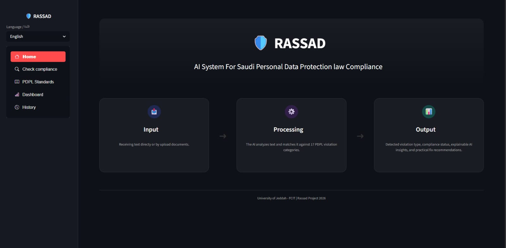
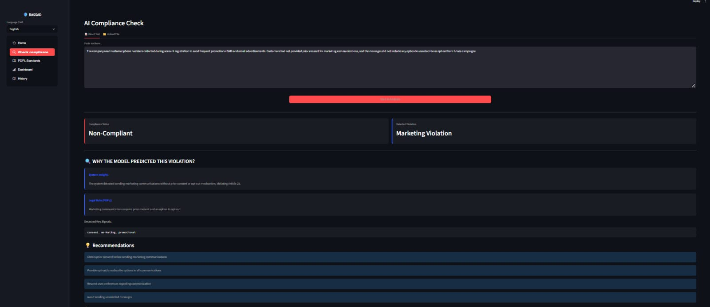
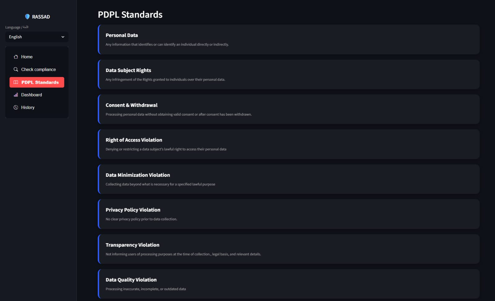
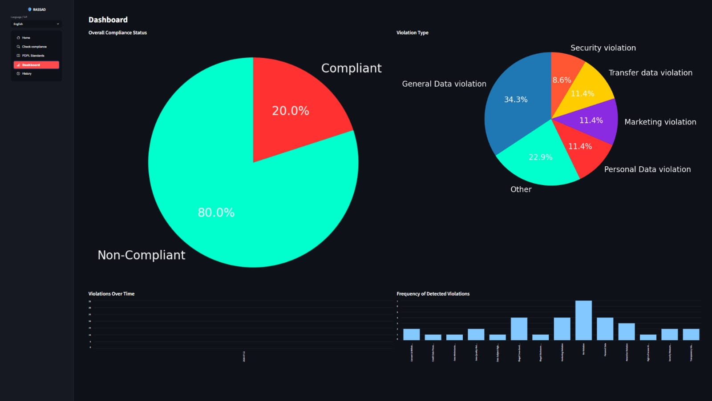

# RASSAD-PDPL-Compliance-Monitoring
AI-Based Compliance Monitoring System for Data Privacy under the Saudi Personal Data Protection Law 

## Overview

Manual PDPL compliance auditing can be time-consuming, error-prone, and difficult to scale as the volume of data increases.

RASSAD is an AI-based compliance monitoring system developed to assist organizations in identifying potential data privacy violations under the Saudi Personal Data Protection Law (PDPL). The system analyzes text to identify and classify potential PDPL violations.

To improve the transparency and interpretability of AI-driven decisions, RASSAD incorporates Explainable AI (XAI) to help users understand the factors contributing to model predictions. The system also generates practical corrective recommendations based on the identified violation type.

By combining Natural Language Processing (NLP), Deep Learning, Explainable AI, and an interactive dashboard, RASSAD provides a scalable decision-support solution for privacy compliance monitoring.

## Objectives

- Identify potential PDPL violations.
- Classify different types of privacy violations.
- Provide explainable AI insights.
- Generate recommendations for potential violations.

##  Key Features

- **PDPL Violation Classification:** Classifies content across 17 PDPL violation categories.
- **Explainable AI:** Uses Integrated Gradients to provide insights into model predictions.
- **Actionable Recommendations:** Generates corrective recommendations based on identified violations.
- **Bilingual Dashboard:** Provides an Arabic/English Streamlit interface for compliance analysis.
- **Multiple Input Formats:** Supports text, Word, PDF, and plain-text files.

##  Methodology

The system follows a multi-stage approach:

1. Text preprocessing
2. PDPL violation classification
3. Explainable AI analysis
4. Recommendations generation
5. Results visualization through an interactive dashboard

## Technologies

- Python
- PyTorch
- Hugging Face Transformers
- DistilRoBERTa
- Pandas
- NumPy
- Scikit-learn
- Streamlit
- Captum (XAI)

## Models & Results

Four models were trained and evaluated for multi-class PDPL violation classification.

| Metric | DistilRoBERTa | BiLSTM | XLNet | TextCNN |
|---|---:|---:|---:|---:|
| Accuracy | 93.85% | **94.65%** | 91.17% | 84.20% |
| F1-Score | **89.99%** | 88.53% | 74.52% | 59.42% |
| Precision | 93.86% | **95.00%** | 90.72% | 83.15% |
| Recall | 93.85% | **94.65%** | 91.17% | 83.15% |

### Final Model

**DistilRoBERTa** was selected as the final model based on its overall F1-score and balanced performance across the violation categories, despite BiLSTM achieving slightly higher accuracy.

## System Demo

### Home

The home page provides an overview of RASSAD and presents the main workflow of the system, from input and AI processing to the generated results.

### Compliance Analysis

The compliance analysis page allows users to enter text or upload documents for analysis. It displays the detected violation type, an XAI-based explanation of why the violation was predicted (linked to the relevant PDPL article), and provides corrective recommendations — all in one view.

### PDPL Standards

A reference page providing a simple definition of each article of the Saudi Personal Data Protection Law (PDPL).

### Dashboard

The interactive dashboard visualizes compliance results, violation distributions, and detected violations through charts and summaries.

##  Future Work

- **Proactive Risk Prediction:** Predict potential compliance risks before violations occur.
- **Enhanced Explainability:** Explore Large Language Models (LLMs) to provide more detailed and user-friendly explanations of model predictions.
- **Adaptive Recommendations:** Develop real-time, context-aware recommendations beyond the current rule-based approach.
- **Expanded Training Data:** Incorporate larger and more diverse real-world datasets to improve model robustness and generalizability.

## Achievement

**Third Place – 3 Minutes Project Competition, University of Jeddah**

The project was recognized with Third Place in the 3 Minutes Project Competition at the University of Jeddah.

##  Project Team
- Lojain Alahmadi
- Lama Alqahtani
- Reham Alhmaidi
- Shahad Mahrous
- Joman Beyari

## Academic Project

Developed as a Bachelor's graduation project in Data Science at the University of Jeddah.

